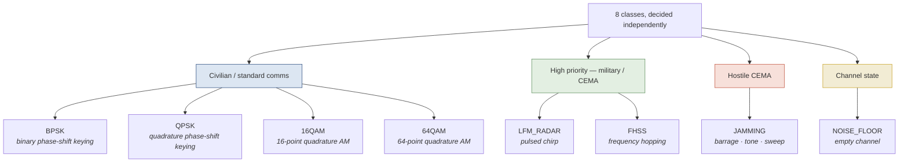
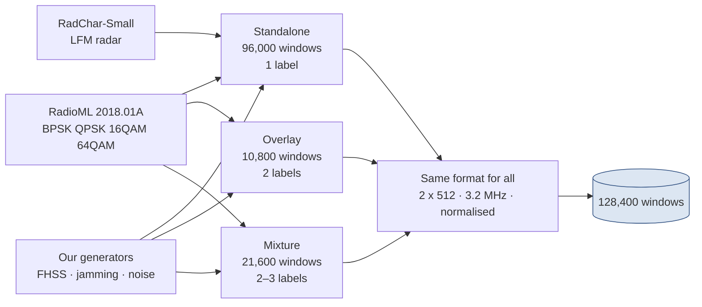
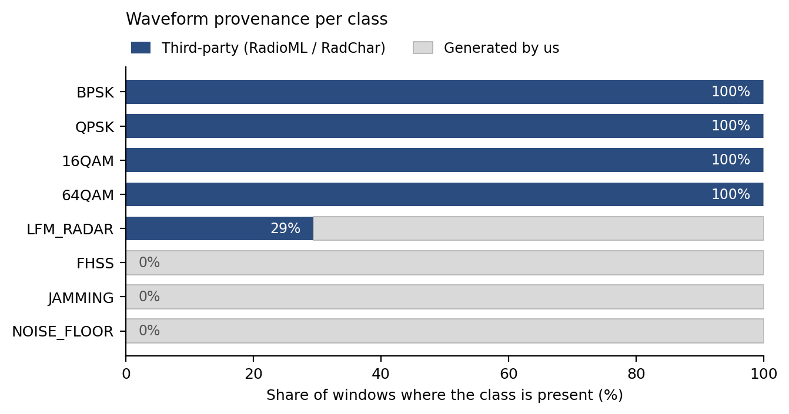
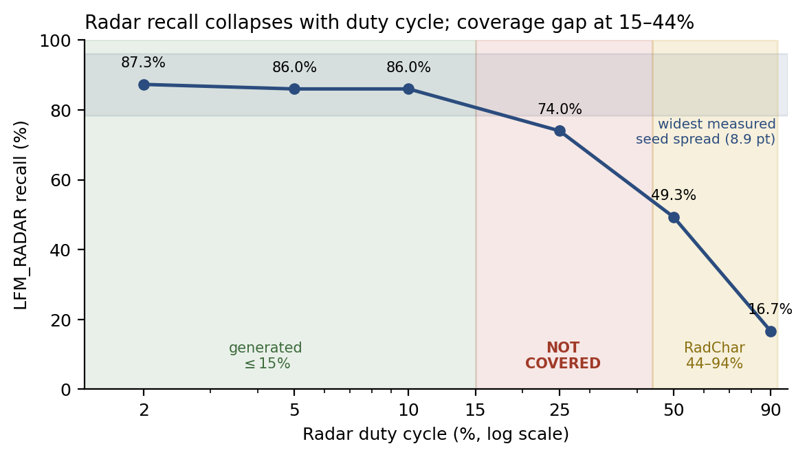
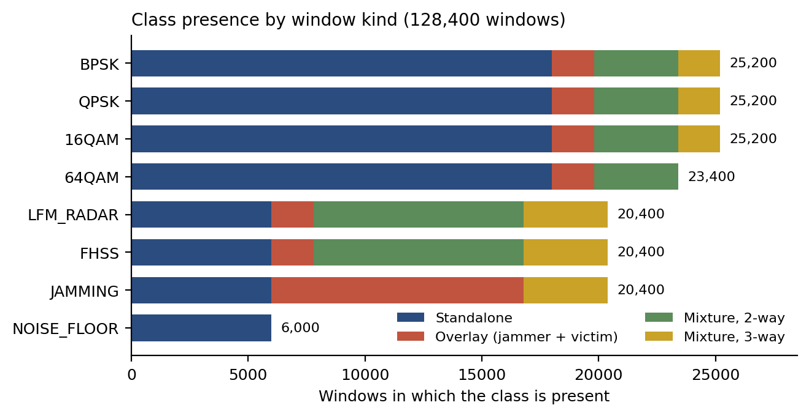
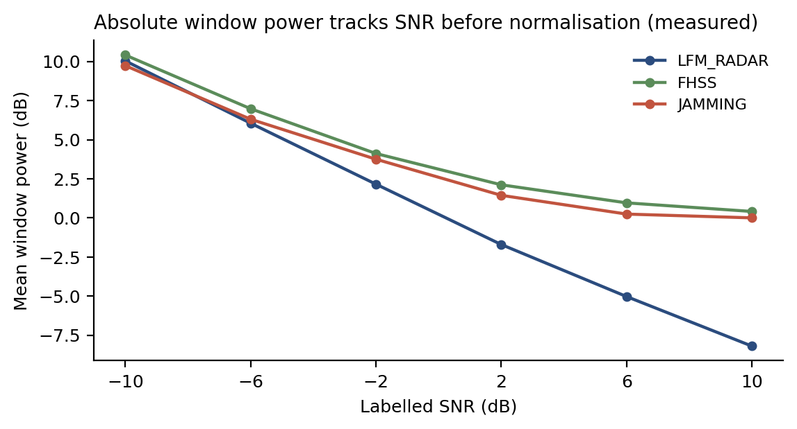

# Technical Brief — Parts 1–3

**Phase 1: Preliminary Stage · Group NEXA · Track I, Project Overwatch: Cognitive CEMA**
SEDIC26: Strategic Electronic Defence Innovation Challenge 2026

| # | Name | University |
|---|---|---|
| 1 | Eavan Tan *(Group Leader)* | Universiti Teknologi PETRONAS |
| 2 | Jessy Pang Xin Yuan | Universiti Teknologi PETRONAS |
| 3 | Chua Xin Ying | Universiti Teknologi PETRONAS |
| 4 | Eileen Yeoh Jing Han | Universiti Teknologi PETRONAS |

**Scope.** This covers the mission, the signal classes, and the dataset. Model architecture,
results and limitations follow in Parts 4–8.

**Dataset version.** Every figure and table here comes from the delivered dataset in
`data/processed/` — 128,400 windows, built 2026-09-03 — and the settings in `configs/default.yaml`.
Rebuild with `python -m src.data.build_dataset`.

**How to read the evidence.** Numbers in this report are one of four things, and each is labelled:

| Label | Meaning |
|---|---|
| **Requirement** | Stated by the organiser |
| **Measured** | A number we obtained by running something |
| **Diagnostic** | A test we ran to understand a problem, not a performance claim |
| **Interpretation** | Our reasoning about why a measurement looks the way it does |

**Acronyms.** AWGN, added background noise · CEMA, cyber electromagnetic activities ·
FHSS, frequency-hopping spread spectrum · IQ, in-phase/quadrature (the raw two-channel radio
signal) · JSR, jammer-to-signal ratio · LFM, linear frequency modulation (a chirp) ·
PRI, pulse repetition interval · SNR, signal-to-noise ratio.

---

## 1.0 Mission Overview

In a contested band, ordinary civilian traffic, military emissions and deliberate interference all
share the same spectrum at the same time. The operator's first question is simple: **who is
transmitting, and are they hostile?**

The task is to answer that from raw IQ samples, in both clean and noisy conditions.

**Requirement — coverage.**

| Tier | Required | Delivered |
|---|---|---|
| Civilian / standard comms | BPSK, QPSK, 16QAM, 64QAM | All four |
| High priority (military / CEMA) | Radar pulses (e.g. LFM) **or** FHSS bursts | **Both** |
| Hostile CEMA | Tell normal comms apart from RF jamming | Jamming, split into barrage, tone and sweep |
| — *(not required)* | — | An explicit empty-channel class |

Two things go beyond the requirement. The high-priority tier asks for radar *or* FHSS, and we
deliver both. We also add an eighth class for an empty channel, so a window with nobody
transmitting is reported as empty instead of being forced into whichever signal class it least
poorly resembles.

**A note on the pass threshold.** The organiser set a minimum of 80% on the three judged classes
(confirmed 2026-08-14, revised down from an initial 90%). The organiser's wording is "accuracy",
but the exact calculation is not defined in the material we were given. **We therefore report
per-class recall in Part 6 and label it as such.** We do not assume our recall figure is the same
number the organiser will compute.

---

## 2.0 The Eight Classes

**Figure 2.1** — The eight classes, grouped by operational tier.

The model gives a separate yes/no answer for each of the eight classes. This matters: a real
window can contain more than one signal at once, so one window may be labelled `QPSK` **and**
`JAMMING` together. Only `NOISE_FLOOR` is exclusive — an empty channel cannot contain an
emitter — and the dataset builder enforces that.

---

## 3.0 Dataset

### 3.1 What the dataset contains

The dataset has three kinds of example.

**Figure 3.1** — How the dataset is assembled.

**Table 3.1 — Kinds of example**

| Kind | What it is | Labels |
|---|---|---|
| Standalone | One signal on its own | 1 |
| Overlay | A jammer sitting on top of a victim signal | 2 (victim + `JAMMING`) |
| Mixture | Two or three signals sharing the window | 2 or 3 |

Overlays and mixtures are **added on top of** the standalone set. No standalone data is replaced.

Standalone examples show each signal in isolation. Real contested spectrum does not work that
way, which is why the other two kinds exist.

### 3.2 Where the signals come from

**RadioML 2018.01A** (DeepSig) supplies the four civilian modulations. It holds 24 modulation
types across 26 SNR levels, 4,096 frames each. We use four types and discard the rest.
Licence CC BY-NC-SA 4.0, which permits non-commercial competition use [1].

> **The labels shipped with RadioML are wrong, and we corrected them.**
>
> The `classes.txt` file distributed with the archive does not match the data inside it. We found
> this by looking at the signals directly: classes 17 and 18 sit at roughly ten times the amplitude
> of everything else, which is what analogue modulation looks like, not the QAM the file claims.
> Class 21 has an almost constant envelope, which means FM.
>
> We instead used the class order printed in the dataset's own source paper [2]. That order is
> consistent with every check we ran, and gives **BPSK = 3, QPSK = 4, 16QAM = 12, 64QAM = 14**.
>
> A separate published analysis reaches the same conclusion using a completely different method [3].
> Two independent methods agreeing is stronger evidence than either alone.
>
> **Why this matters:** using the shipped labels would have mislabelled every civilian example,
> silently. Nothing in the training metrics would have shown it.
>
> *Remaining uncertainty:* we did not separately confirm which of classes 3 and 4 is BPSK and which
> is QPSK. Doing so properly would need full carrier recovery.

*One point of disagreement worth stating.* DeepSig's own description of the archive mentions
over-the-air recordings. The analysis in [3] concludes the signals in this particular file are
computer-generated. We follow [3]. We note the disagreement rather than pretending it is settled.

**RadChar-Small** (Huang et al., ICASSP 2023) supplies the radar. Its waveforms are exactly 512
samples at 3.2 MHz, with labels for pulse width, pulse count, timing and SNR. We take
`signal_type = 4`, the linear-FM chirps [4]. RadChar states that it is a synthetic dataset.
*Licence still to be confirmed against the copy we used.*

**Our own generators** supply FHSS, jamming and the empty channel. No suitable third-party source
exists for these three.

**Figure 3.2** — How much of each class comes from an outside source.

**Table 3.2 — Source of each class**

| Class | Outside source | Share of windows from that source |
|---|---|---:|
| BPSK, QPSK, 16QAM, 64QAM | RadioML 2018.01A | 100% |
| LFM_RADAR | RadChar-Small | 29.4% |
| FHSS, JAMMING, NOISE_FLOOR | none | 0% |

The radar figure needs care. Every *standalone* radar window is real RadChar data. But overlays and
mixtures build their radar with our own generator, so across all windows containing radar,
**6,000 of 20,400 (29.4%)** are RadChar. Feeding real waveforms into the composite paths is a
known next step, not something we have done.

Counting whole windows: 78,000 (60.7%) contain only outside waveforms, and 105,000 (81.8%)
contain at least one.

**Why outside data is worth having.** Neither source is recorded off the air, so neither proves the
model works on real receivers. What they do give us is code written by other people. If our model
classifies RadChar chirps correctly, it learned what a chirp is — not a quirk of our chirp
generator. A test set carved out of our own data cannot show that, no matter how carefully we hold
it back.

### 3.3 How we generate the signals we could not source

Each generator randomises its settings for every example, so the model sees a general signal type
rather than one fixed pattern. Each is covered by tests that check the maths does what the class
name says.

| Class | How it is built | The constraint that matters |
|---|---|---|
| **FHSS** | Jumps between channels on a randomised grid | The time spent on each channel must be much shorter than the window, or every example holds one frequency and becomes a tone |
| **Jamming — barrage** | Noise restricted to a chosen band | Band-limiting gives it a shape; pure white noise has none |
| **Jamming — tone** | A single continuous carrier | Single carrier only (see §3.4) |
| **Jamming — sweep** | A chirp scanning continuously | Told apart from radar by having no listening gap |
| **NOISE_FLOOR** | Plain background noise | Deliberately has no structure at all — that absence is what identifies it |

**Overlays** put a jammer on top of a real victim: one of the four civilian classes, radar, or FHSS.
The jammer strength is drawn from the same range standalone jamming uses, so overlays add no new
untested setting. An empty channel is never a victim, and jamming is never its own victim.

**Mixtures** cover the cases that are not about jamming — two or three legitimate transmitters
sharing a window, which is the normal state of a busy band. We generate military × military,
military × civilian, and three three-way combinations. We deliberately kept three-way examples to
three combinations so the hardest case does not dominate the dataset.

Two decisions about signal strength do real work:

- Signals are combined at a **random strength difference** (−6 to +6 dB), not at equal power. The
  model therefore has to find the weaker transmitter, instead of only ever seeing balanced mixes.
- Power is measured **only over the parts of the window that actually contain signal**. A pulsed
  radar window is mostly silence. Averaging across the whole window would understate its power
  several times over and place a low-duty radar far below a continuous carrier, even at a nominal
  0 dB ratio. That would get the strength wrong for exactly the class being judged.

When a mixture includes jamming, the jammer goes on last, against everything else combined —
because the jammer's strength is defined relative to what it is jamming, and here that is all of it.

Civilian windows used *inside a mixture* are taken from RadioML's cleanest bins (≥ 24 dB) and
treated as clean, so the finished window gets noise added exactly once and its SNR label describes
the whole window. Standalone civilian examples and jamming overlays keep RadioML's own noise.

### 3.4 Settings and SNR coverage

Every setting below is randomised per example within the range shown.

**SNR bins.** Six levels — −10, −6, −2, +2, +6, +10 dB — applied to every class. The lower three put
more noise in the window than signal. All six bins hold exactly **21,400 windows**, so the coverage
is even.

> The bins have to be even numbers. RadioML only provides SNR in 2 dB steps, so an odd value returns
> no civilian examples at all. That bin would then contain only military and hostile classes, and the
> model could learn "odd SNR means threat" instead of learning the signals. Our own generators accept
> any value, so RadioML sets the constraint.

**Table 3.3 — Radar settings**

| Setting | Range |
|---|---|
| Pulse width | 10–100 µs |
| Chirp bandwidth | 50 kHz – 1.5 MHz |
| Pulse repetition interval | 17 µs – 10 ms |
| Time delay | 1–10 µs |
| Pulses per burst | 2–6 |
| Maximum duty cycle | 15% |

*Duty cycle* is the fraction of time the radar is actually transmitting.

These ranges cover two different regimes on purpose. RadChar's own waveforms run at 44–94% duty
cycle, which comes from packing 2–6 pulses into a short frame rather than from how radar behaves in
the field, where 0.1–10% is normal. Covering both means we are not betting on one.

Pulse width stays below the window length so every window can show a pulse followed by silence.
That silent gap is what separates radar from a sweep jammer, which never stops.

**Figure 3.3** — Diagnostic: radar recall as duty cycle increases.

**Diagnostic — Table 3.4: radar recall against duty cycle**

| Duty cycle | 2% | 5% | 10% | 25% | 50% | 90% |
|---|---|---|---|---|---|---|
| Radar recall | 87.3% | 86.0% | 86.0% | 74.0% | 49.3% | 16.7% |

This was a diagnostic sweep against a trained model during development, not a performance claim
about the final system.

Repeated identical training runs vary by 2.2–8.9 points on radar and FHSS, so the 2 / 5 / 10%
figures are not meaningfully different from each other. The 25% point sits just outside that
spread, and the 50% and 90% collapses are clear.

**Interpretation.** At 90% duty, 116 of 150 radar examples were called FHSS. That is not a bug. A
radar that almost never stops is one chirp after another, which genuinely looks like frequency
hopping. Above roughly 15% duty the two classes stop being separable, and generating there would
teach the model that the same shape is sometimes radar and sometimes FHSS. So we cap generation at
15%, which is also inside the realistic range.

> **Limitation — a gap in coverage.** Our generator covers up to 15% duty and RadChar covers
> 44–94%. **Nothing covers 15–44%.** Also, RadChar only appears in standalone windows, so every
> radar window that contains more than one signal is low-duty synthetic.

**Table 3.5 — FHSS settings**

| Setting | Range |
|---|---|
| Hop rate | 25–150 kHz |
| Channels | 8–64 |
| Channel spacing | 10–48 kHz |

This gives 4–24 hops per window. Channel spacing is capped so the outermost hop stays inside the
sample rate's limit: 64 channels at 48 kHz spans ±1.536 MHz against a ±1.6 MHz ceiling. A test
enforces this.

> **Limitation — we model fast hopping only.** A slow-hopping radio stays on one channel for longer
> than our 160 µs window, so hopping is invisible and the signal is indistinguishable from a tone.
> This follows from the window length, which is fixed by RadChar (§3.5), not from a free choice.

**Table 3.6 — Jamming settings**

| Setting | Range |
|---|---|
| Jammer-to-signal ratio | 0–20 dB |
| Simultaneous tones | 1 |
| Sweep bandwidth | 100–500 kHz |
| Barrage bandwidth | 200 kHz – 1.2 MHz |

Two of these were set by measurement rather than assumption. A diagnostic that scored jamming by
sub-type gave barrage 79.5%, tone 56.5% and sweep 96.5%, and showed two specific confusions:

- **Tone jamming was being called FHSS** (85 of 200 examples). Several carriers at once produce a
  spectrum with several peaks, which is also what FHSS produces as it visits channels. We reduced
  simultaneous tones from 3 to 1, because a single carrier clearly is not hopping.

  > **Limitation.** This narrows the class. `JAMMING` now means single-tone jamming. Multi-tone
  > jamming is a real threat and is out of scope.

- **Barrage jamming and radar were being confused** in both directions (35 of 200 barrage called
  radar, 20 of 200 radar called jamming). Low-duty radar buried in noise is also mostly noise. We
  restricted barrage to a band, which gives it a spectral shape that plain white noise does not
  have. Real barrage jammers target the frequencies in use anyway, so this is also more realistic.

**Table 3.7 — Composite proportions**

| Setting | Value |
|---|---|
| Overlay examples | 30% of the per-class count, per victim class per SNR bin |
| Mixture examples | 30% of the per-class count, per combination per SNR bin |
| Strength difference between components | −6 to +6 dB |
| "Clean" threshold for RadioML inside mixtures | ≥ 24 dB |

### 3.5 How many examples, and how they split

**Table 3.8 — Dataset size**

| Kind | Labels | Generated per class or combination, per SNR bin | Windows | Share |
|---|---|---|---:|---:|
| Standalone | 1 | 1,000 (civilian 3,000) | 96,000 | 74.8% |
| Overlay | 2 | 300 × 6 victim classes | 10,800 | 8.4% |
| Mixture, 2-way | 2 | 300 × 9 combinations | 16,200 | 12.6% |
| Mixture, 3-way | 3 | 300 × 3 combinations | 5,400 | 4.2% |
| **Total** | | | **128,400** | **100%** |

**Figure 3.4** — How often each class appears, and in what kind of window.

**Table 3.9 — How often each class appears**

Counts are windows *containing* that class. Rows add up to more than 128,400 because composite
windows carry two or three labels.

| Class | Standalone | Overlay | Mixture 2-way | Mixture 3-way | Total | % of windows |
|---|---:|---:|---:|---:|---:|---:|
| BPSK | 18,000 | 1,800 | 3,600 | 1,800 | 25,200 | 19.6% |
| QPSK | 18,000 | 1,800 | 3,600 | 1,800 | 25,200 | 19.6% |
| 16QAM | 18,000 | 1,800 | 3,600 | 1,800 | 25,200 | 19.6% |
| 64QAM | 18,000 | 1,800 | 3,600 | 0 † | 23,400 | 18.2% |
| LFM_RADAR | 6,000 | 1,800 | 9,000 | 3,600 | 20,400 | 15.9% |
| FHSS | 6,000 | 1,800 | 9,000 | 3,600 | 20,400 | 15.9% |
| JAMMING | 6,000 | 10,800 | 0 | 3,600 | 20,400 | 15.9% |
| NOISE_FLOOR | 6,000 | 0 | 0 | 0 | 6,000 | 4.7% |
| **Windows** | **96,000** | **10,800** | **16,200** | **5,400** | **128,400** | |

† The three-way combinations use BPSK, QPSK and 16QAM. 64QAM is not among them, so it appears in
1,800 fewer windows than the other civilian classes.

**One useful consequence.** The three judged classes appear in exactly the same number of windows —
20,400 each. Whatever separates their results in Part 6, it is not that one of them had less data.

**Why these counts.** Raising the standalone count from 400 to 1,000 fixed clear overfitting
(training loss 0.068 against validation loss 0.317 at 400) and improved all three judged classes.
Raising it again to 2,000 changed nothing measurable and doubled training time, so we kept 1,000.

Civilian classes are drawn at 3,000 per SNR bin instead. Civilian recall is the weakest part of the
system, and RadioML holds up to 4,096 examples per bin, so drawing more of what already exists was
a cheap way to test whether the problem is simply data volume. The competing explanation is that
dense QAM constellations are hard to separate under noise, which published work also reports as a
known difficulty [5], [6].

> **Honest status.** This setting is shipped, and the change was clean: standalone civilian windows
> went from 24,000 to 72,000 while every other count stayed identical. But **we have not yet scored
> the earlier build to compare, so we cannot say whether the extra data helped.** That measurement
> is outstanding.

**Splitting.** The data is split 70 / 15 / 15 into training, validation and test. Details of how the
split handles multi-label windows are in Part 7.

### 3.6 One format for everything

**Table 3.10 — The format every example must meet**

| Property | Value |
|---|---|
| Sample rate | 3.2 MHz |
| Window length | 512 samples = 160 µs |
| Shape | 2 × 512 (I and Q as separate channels) |
| Normalisation | Zero mean, unit standard deviation, per window |

Every example arriving at the model has this shape and these statistics, whichever source produced
it. This is what lets three sources with different conventions be trained on together, and it is
enforced by tests.

**Why 3.2 MHz and 512 samples.** Both come from RadChar, the only source with a fixed length *and*
a fixed sample rate. Everything else is flexible, so everything else matches it. The alternative —
a longer window with RadChar padded out to fit — would leave half of every real radar example flat,
and the model would learn "flat tail means radar". That would score well on our data and mean
nothing.

The sample rate also has to be more than twice the highest frequency any generator produces, or
signals fold back and appear at the wrong frequency. Tests check this rather than assuming it, and
they caught two real cases during setup.

**Why normalisation matters.**

**Figure 3.5** — Measured: average window power against labelled SNR, before normalisation, over 30
generated examples per class per bin.

**Measured.** Raw window power changes by about 18 dB across the SNR range, and the slope is
different for each class. A pulsed radar loses whole-window power faster than a continuous
transmitter as noise is reduced. Our three sources also define SNR differently from one another.

**Interpretation.** Left alone, raw loudness would be a usable clue that has nothing to do with what
the signal *is*. It would be easy to learn, so the model would prefer it over real signal structure,
and no accuracy number would reveal the problem.

Normalising every window to the same scale removes loudness entirely, which is what makes signals
from different sources comparable. The same applies to the empty-channel class: its loudness is
normalised away, leaving only what actually identifies it, which is having no structure.

---

## References

1. DeepSig Inc., *RadioML 2018.01A*. Licence CC BY-NC-SA 4.0. https://www.deepsig.ai/datasets/
2. T. J. O'Shea, T. Roy and T. C. Clancy, "Over the Air Deep Learning Based Radio Signal
   Classification," *IEEE Journal of Selected Topics in Signal Processing*, vol. 12, no. 1,
   pp. 168–179, 2018. arXiv:1712.04578, Section III. https://arxiv.org/abs/1712.04578
3. C. M. Spooner, "DeepSig's 2018 Dataset," *cyclostationary.blog*, September 2020.
   https://cyclostationary.blog/
4. Z. Huang, A. Pemasiri, S. Denman, C. Fookes and T. Martin, "Multi-Task Learning for Radar Signal
   Characterisation," *IEEE ICASSP Workshops*, 2023. arXiv:2306.13105.
   Dataset: https://github.com/abcxyzi/RadChar
5. O. F. Abd-Elaziz, M. Abdalla and R. A. Elsayed, "Deep Learning-Based Automatic Modulation
   Classification Using Robust CNN Architecture for Cognitive Radio Networks," *Sensors*, vol. 23,
   no. 23, art. 9467, 2023. doi:10.3390/s23239467.
   https://pmc.ncbi.nlm.nih.gov/articles/PMC10708862/
6. "Automatic Modulation Classification Based on Constellation Density Using Deep Learning," IEEE.
   **[Incomplete — authors, venue and year must be filled in or this reference removed.]**

---

## Outstanding items

| # | Item | Section |
|---|---|---|
| 1 | Confirm RadChar's licence for the copy we used | 3.2 |
| 2 | Complete reference [6], or remove it | References |
| 3 | Score the earlier 80,400-window build to see whether the extra civilian data helped | 3.5 |
| 4 | Add a 64QAM three-way combination, or keep the current footnote as the stated reason | 3.5 |
| 5 | Carry three limitations into Part 8: single-tone jamming, fast-hopping FHSS only, 15–44% duty-cycle gap | 3.4 |
